# shader-and-vfx-testbed

A playground for exploring new ideas for shaders and visual effects in Unity. This repository will be continually updated, as explorations are ongoing.

### Areas Explored (with examples below)
- Raymarching
- Iridescence 
- Toon Shading
- Vertex Displacement
- Water w/ Depth Textures
- Distortion w/ Opaque Textures
- Using Depth Textures w/ Particles
- Particle Collisions
- Particle Strips
- Mesh-Based Particles
- & More...

## Shaders

### Raymarching
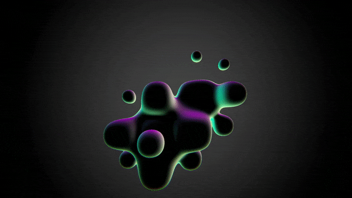
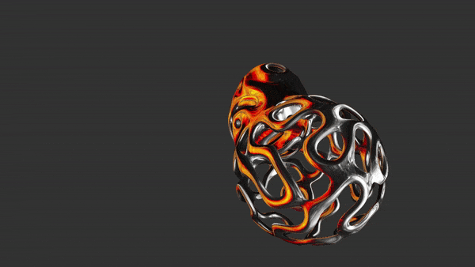

### Iridescence
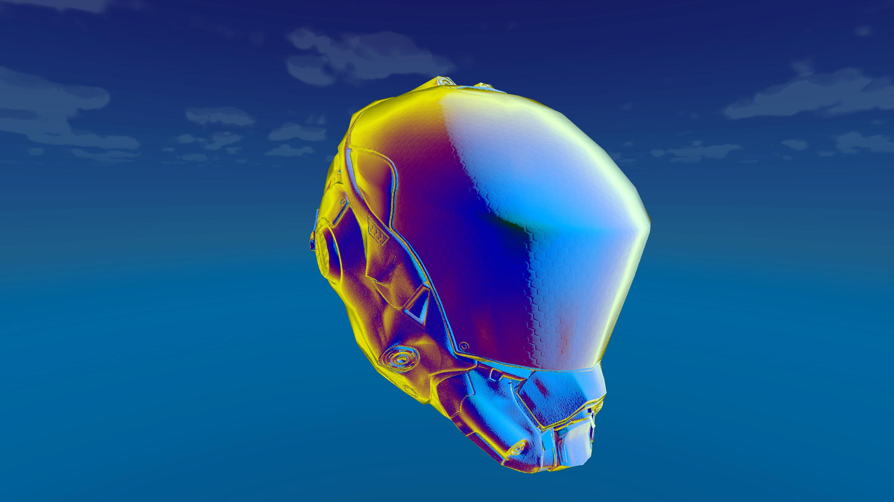

### Toon Shading
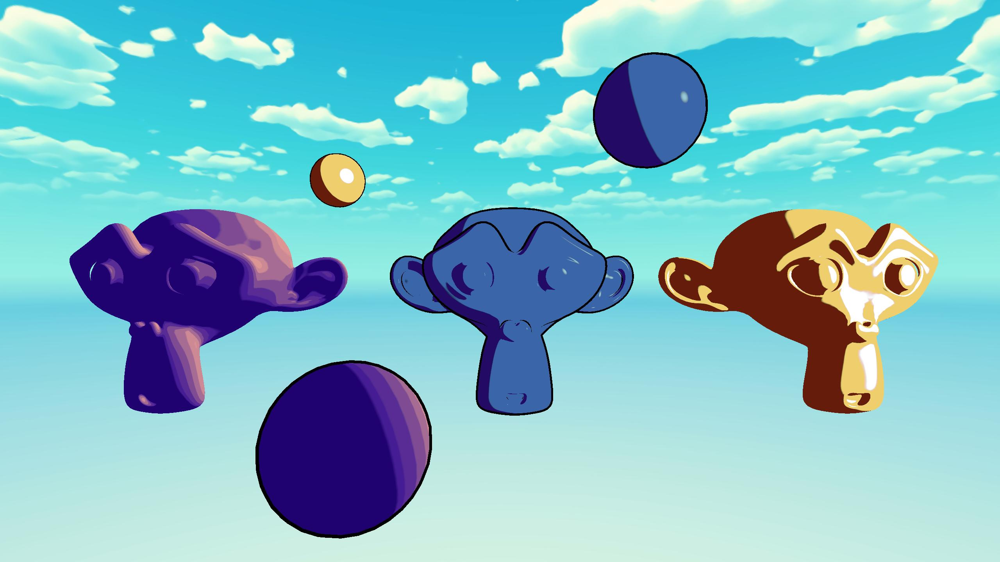

### Vertex Displacement
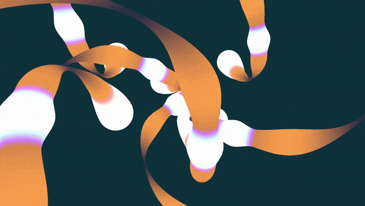

### Water w/ Depth Textures
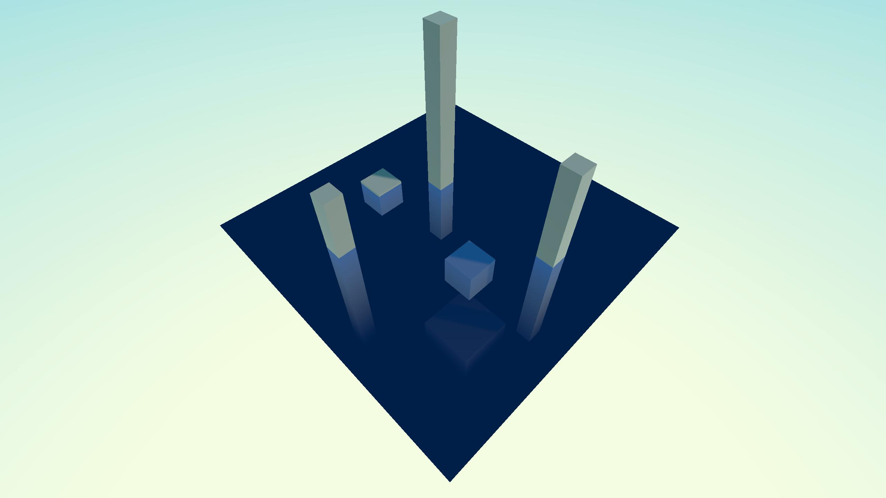

### Distortion w/ Opaque Textures
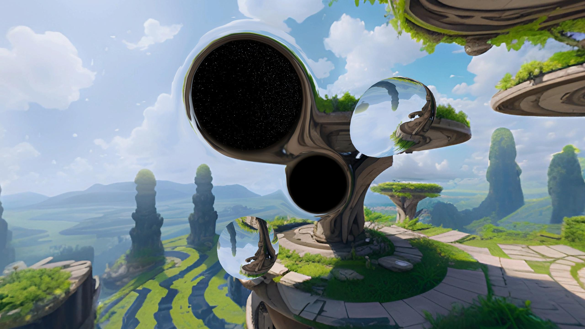

## VFX

### Using Depth Textures w/ Particles
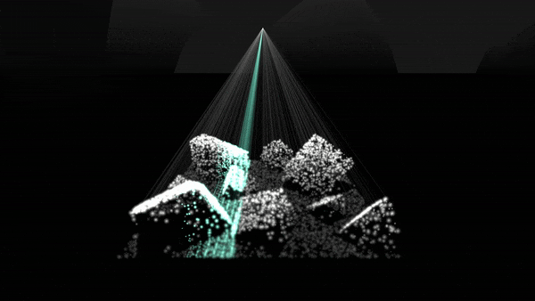

### Particle Collisions
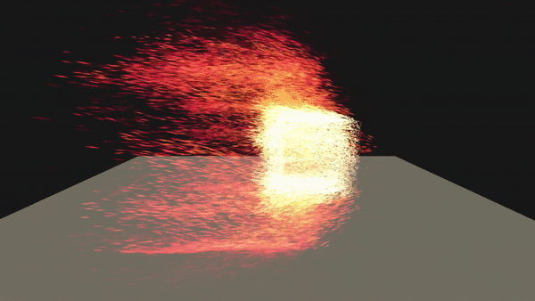

### Particle Strips
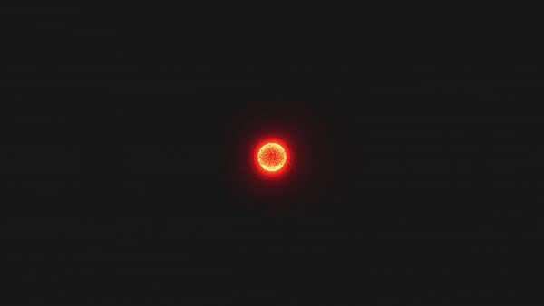

### Mesh Based Particles
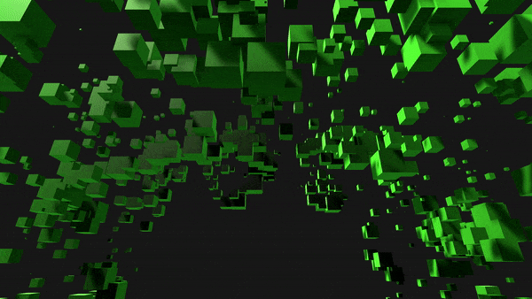
